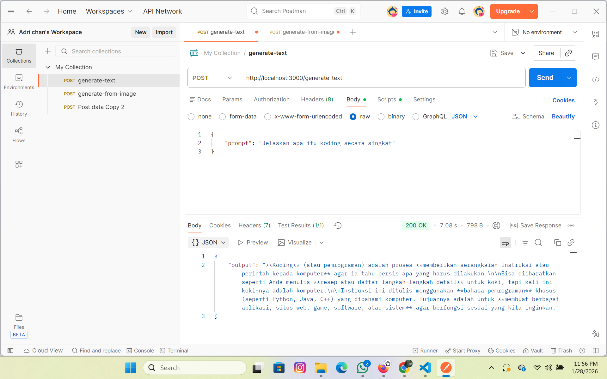

# Gemini Flash API 🚀

Proyek ini adalah RESTful API sederhana yang dibangun menggunakan **Node.js** dan **Express**. Aplikasi ini berfungsi sebagai *middleware* untuk menghubungkan permintaan klien (seperti Postman atau Front-end) dengan model AI terbaru Google, yaitu **Gemini 2.5 Flash** [1].

## 🌟 Fitur Utama

Proyek ini mendukung kemampuan **Multimodal** (berbagai jenis input) [1], [2]:

*   **📝 Text Generation:** Mengirim prompt teks dan mendapatkan balasan cerdas dari AI.
*   **🖼️ Image Analysis:** Mengunggah gambar untuk dideskripsikan atau dianalisis oleh AI.
*   **📄 Document Processing:** Mengunggah file dokumen (PDF/TXT) untuk diringkas atau dianalisis isinya.
*   **mic Audio Transcription:** Mengunggah file audio (MP3/WAV) untuk dibuatkan transkrip atau ringkasannya.

## 🛠️ Teknologi yang Digunakan

*   **Node.js & Express:** Framework utama untuk server API [3].
*   **Google Generative AI SDK:** Library resmi untuk mengakses model Gemini [3].
*   **Multer:** Middleware untuk menangani upload file (multipart/form-data) [4].
*   **Dotenv:** Manajemen keamanan untuk menyimpan API Key [3].

## 🚀 Cara Menjalankan (Local)

1.  Clone repositori ini.
2.  Install dependencies: `npm install`
3.  Buat file `.env` dan masukkan API Key: `GEMINI_API_KEY=kunci_anda`
4.  Jalankan server: `node index.js`
5.  Akses via Postman di `http://localhost:3000`

